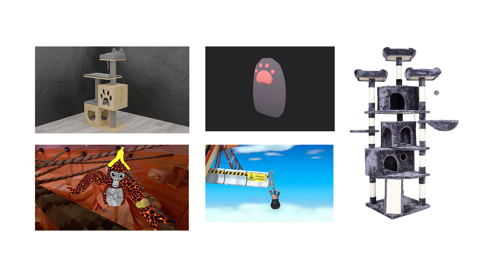
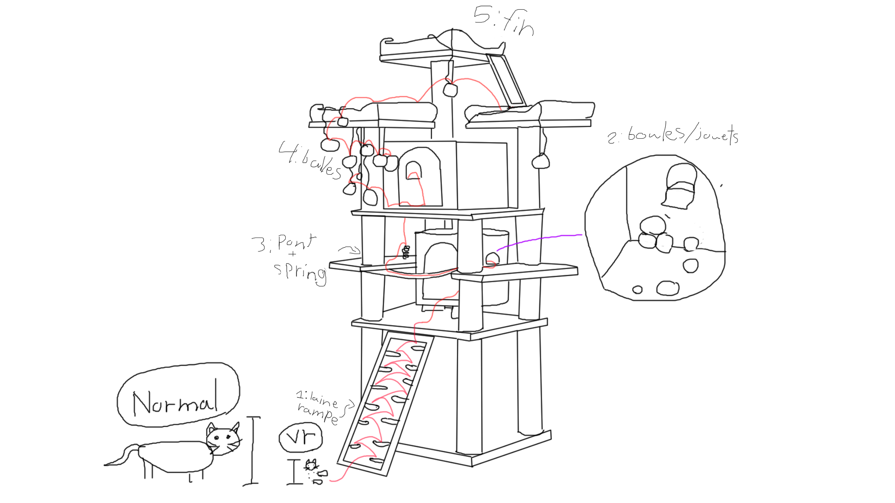
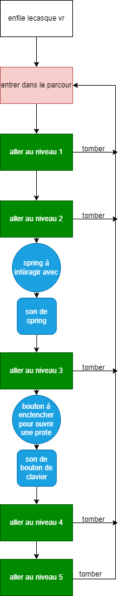

# plan_projet_vr

## Résumé en une phrase 

 un jeu type 'getting over it' avec les mécaniques de gorilla tag, mais avec des chat et un arbres à chats.

## Description écrite

### Synopsi/Desciption
pierrot est un chaton qui veux monter le nouveau arbre à chat que sa famille a acheté pour lui. cet arbre parait giantesque, mais cela est parce que pour son jeune âge tout a l'air plus grand.

Ensuite, l'utilisateur montera dans l'arbre à chat surdimentionné pour essayer de se rendre au sommet. cependant, plusieurs trous et éléments de parcour le fera redéssendre en arrière dans l'arbre.
Tout cela en utilisant les mains pour se propulser avec le sol.

## Moodboards

### son:

https://uppbeat.io/browse/sfx/cartoon

https://artlist.io/royalty-free-music/song/wandering-caterpillar---scene-1/72166

https://artlist.io/royalty-free-music/song/waterfront-chill/119673

https://artlist.io/royalty-free-music/song/the-cycle-continues/115840

## Carte

##

